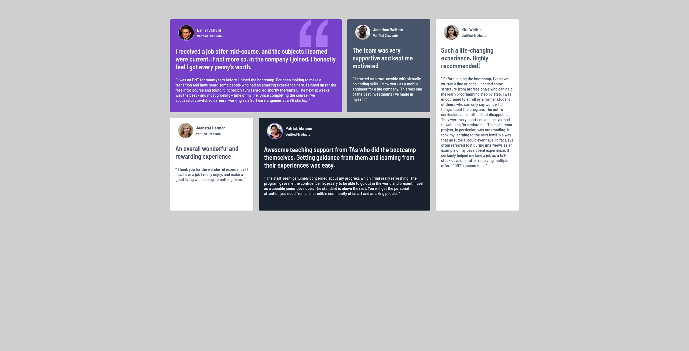

### The challenge

Users should be able to:

- View the optimal layout for the site depending on their device's screen size

### Screenshot

### Links

- Live Site URL: [Live Page](https://thignvs.github.io/Testimonials-grid-section/)

### Built with

- Semantic HTML5 markup
- CSS custom properties
- Flexbox
- CSS Grid
- Mobile-first workflow

### What I learned

Excellent project to train flex box and grid box!!!!# Testimonials-grid-section
